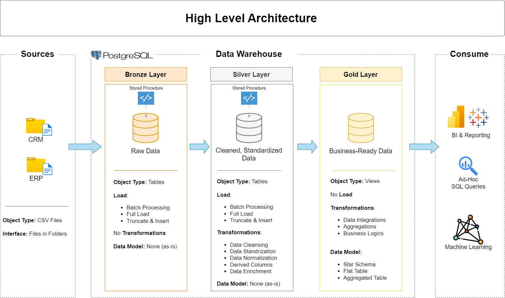

# SQL Data Warehouse Project  

Welcome to the **SQL Data Warehouse Project**! 🚀  
This repository demonstrates how to design and implement a **data warehouse** using PostgreSQL, with a focus on ETL pipelines, layered data architecture, and analytical modeling.  

---

## 🏗️ Data Architecture  

The warehouse follows the **Medallion Architecture** with three layers:  

  

1. **Bronze Layer**: Stores raw data as-is from the source systems. Data is ingested from CSV Files into SQL Server Database.
2. **Silver Layer**: This layer includes data cleansing, standardization, and normalization processes to prepare data for analysis.
3. **Gold Layer**: Houses business-ready data modeled into a star schema required for reporting and analytics. 

Additional diagrams are available in the [`/docs`](./docs) folder:  
- `ETL.png` – End-to-end ETL workflow  
- `data_flow.png` – Data flow diagram  
- `data_integration.png` – Integration process  
- `data_model.png` – Star schema data model  
- `data_catalog.md` – Dataset field descriptions and metadata  

---

## 📖 Project Overview  

This project demonstrates:  

1. **Data Architecture**: Designing a Modern Data Warehouse Using Medallion Architecture **Bronze**, **Silver**, and **Gold** layers.
2. **ETL Pipelines**: Extracting, transforming, and loading data from source systems into the warehouse.
3. **Data Modeling**: Developing fact and dimension tables optimized for analytical queries. 

🎯 Skills Practiced:  
- SQL & PL/pgSQL Development  
- ETL Pipeline Design  
- Data Modeling (Star Schema)  

---

## 📂 Repository Structure
```
data-warehouse-project/
│
├── datasets/                           # Raw datasets used for the project (ERP and CRM data)
│
├── docs/                               # Project documentation and architecture details
│   ├── etl.png                      
│   ├── data_architecture.png        
│   ├── data_catalog.md                
│   ├── data_flow.png                
│   ├── data_models.png             
│   ├── data_integration.png             
│
├── scripts/                            # SQL scripts for ETL and transformations
│   ├── bronze/                         # Scripts for extracting and loading raw data
│   ├── silver/                         # Scripts for cleaning and transforming data
│   ├── gold/                           # Scripts for creating analytical models
│
│
└── README.md                           # Project overview and instructions
```
---
## 🌟 About Me

Hi, I’m **Shambhu Prasad Sah** — a Computing graduate passionate about **data engineering, analytics, and cloud solutions**.  
I have experience in **Python, SQL, Databricks, Azure, Tableau, and Power BI**, building ETL pipelines, data warehouses, and interactive dashboards.

Let's stay in touch! Feel free to connect with me on the following platforms:

[](https://www.linkedin.com/in/sahshambhu/)
